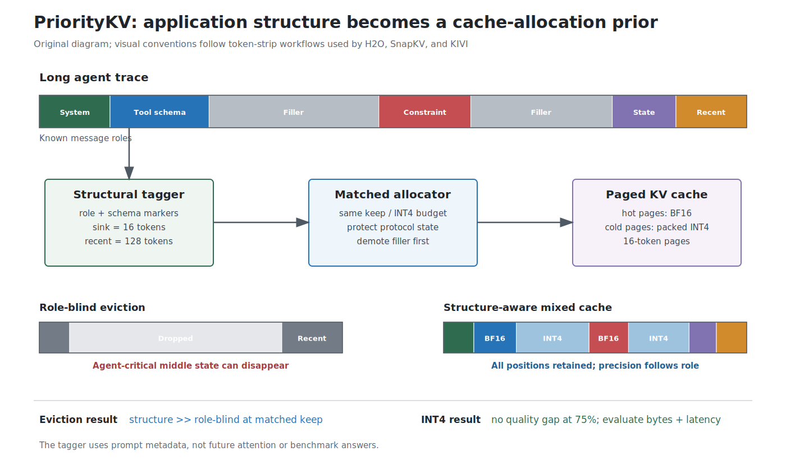
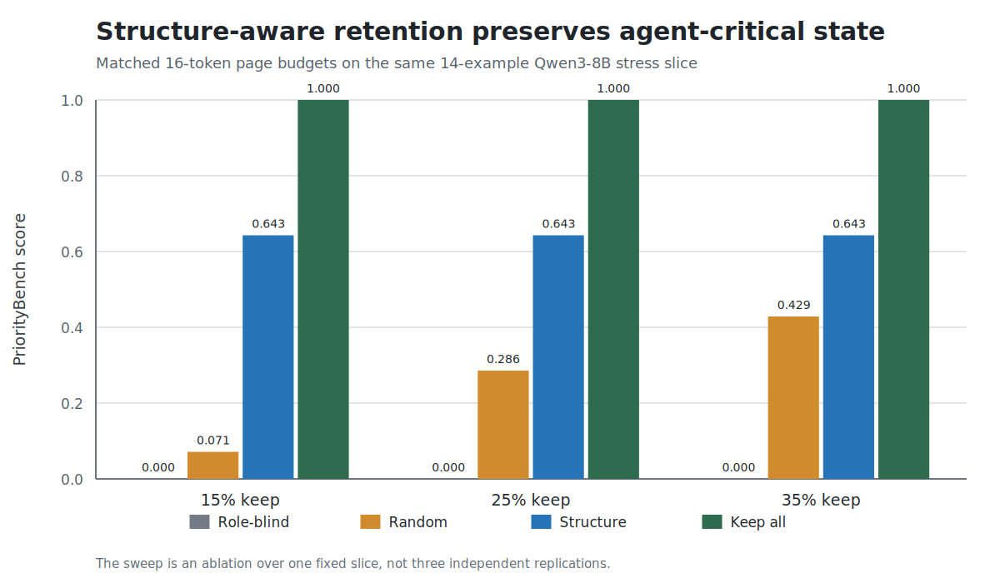

# PriorityKV

Structure-aware KV retention for long agent traces — keep the tokens that matter
(tool schemas, constraints, state) when the cache must shrink — plus a packed
BF16/INT4 systems path with honest latency and memory reporting.

**Arush Sharma** (IIT (ISM) Dhanbad), **Anupam Rawart** (IIT Bombay)  
Apache-2.0 · Python 3.11–3.12 · Primary eval: Qwen3-8B on NVIDIA H200



## Research question

Agent traces mix tool schemas, superseding instructions, persistent IDs, and ordinary
dialogue in one KV cache. Losing the wrong tokens can look fine on average metrics
while silently breaking agent behavior. PriorityKV asks whether **application-visible
message structure** should decide what to keep (and at what precision).

Scoped conclusions (see [`docs/EVIDENCE.md`](docs/EVIDENCE.md) for the audit trail):

1. **Eviction vs position-blind (strong on Qwen):** at matched keep budgets, structure-aware
   retention far exceeds uniform/random keep.
2. **Vs SnapKV-class (Qwen, cautious):** structure **matches or slightly exceeds** SnapKV /
   Pyramid / hybrid (0.933 vs 0.900, n=120; McNemar **p=0.125**, not significant). Hybrid
   does **not** improve on SnapKV.
3. **Vs FullKV:** **not claimed.** Mid-context control ties FullKV; buried control loses to it.
4. **Quantization (falsified):** soft INT4 at `int4_frac=0.75` does not open a PriorityBench gap.
5. **Transfer:** Llama kf=0.25 is saturated for all arms; at kf=0.05 SnapKV outperforms structure
   (two slices). Treat as honest negative / non-discriminative until a gold-region audit.
6. **Systems:** packed payload + frozen D4/MG latency/peak; P2 streamed-cold is **smoke only**
   (~36 GiB peak in log).

## Key results

Full tables, job IDs, and external-audit checklist: [`docs/EVIDENCE.md`](docs/EVIDENCE.md) · [`RESULTS.md`](RESULTS.md).

| Experiment | Result |
|---|---|
| P0 token keep 25% (Qwen, n=120) | structure **0.933** vs uniform/random **~0.008** |
| P0 mid-context control (s0) | structure = full = **0.975**; uniform/random **0.025** |
| P0 buried control (s0) | structure **0.675** < full **0.900**; uniform/random **0** |
| P1 vs SnapKV/Pyr/hybrid (Qwen, n=120) | **0.933** vs **0.900** (112 vs 108; McNemar **p=0.125**) |
| P1 H2O chunked (pooled) | **0.683** = (0.725+0.625+0.700)/3 |
| P3 Llama kf=0.25 (n=120) | all arms **1.000** (saturated) |
| P3 Llama kf=0.05 (s0+s1) | SnapKV **1.0** > structure **0.875 / 0.900** |
| Locked mixed quality (`n=240`) | FullKV **0.8875**, structure **0.8833**, uniform **0.8792** |
| Packed payload / peak / E2E / TPOT | **0.719×** · **0.868×** · **1.11–1.12×** · **1.20–1.21×** (frozen D4/MG) |



## Artifacts

| Artifact | Purpose |
|---|---|
| [`docs/EVIDENCE.md`](docs/EVIDENCE.md) | P0–P3 track + **external audit response** |
| [`RESULTS.md`](RESULTS.md) | Canonical metrics and claim boundary |
| [`docs/DATASET.md`](docs/DATASET.md) | PriorityBench-A tasks, strata, and generation |
| [`FINAL_RUN_MANIFEST.yaml`](FINAL_RUN_MANIFEST.yaml) | Frozen model, benchmark, configs, and job IDs |
| [`paper/prioritykv.tex`](paper/prioritykv.tex) | Standalone arXiv source |
| [`paper/prioritykv_manuscript.md`](paper/prioritykv_manuscript.md) | Readable source manuscript |
| [`docs/REPRODUCIBILITY.md`](docs/REPRODUCIBILITY.md) | Reproduction levels and commands |
| [`docs/H200_QUEUE.md`](docs/H200_QUEUE.md) | Git→H200 job queue |
| [`docs/BLOG.md`](docs/BLOG.md) | Accessible research summary |
| [`CITATION.cff`](CITATION.cff) | Citation metadata |

Main source modules:

```text
src/prioritybench/    deterministic benchmark generator and scorers
src/prioritykv/       roles, policies, packed cache, and FlashInfer decode
configs/              frozen experiment configurations
jobs/                 canonical H200 commands and result bundles
tests/                CPU unit and contract tests
paper/figures/        reproducibly generated SVG/PDF figures
```

## Local reproduction

Install the CPU development environment and run the complete local check:

```bash
git clone https://github.com/Arush777/Priority_KV.git
cd Priority_KV
./scripts/sync.sh
./scripts/check.sh
```

Regenerate and audit PriorityBench-A:

```bash
PYTHONPATH=src uv run python scripts/mk_bench.py --mode w3_lock
PYTHONPATH=src uv run python scripts/audit_bench.py
```

Regenerate all paper figures from tracked frozen artifacts:

```bash
uv run python scripts/make_publication_figures.py
```

## GPU reproduction

GPU dependencies are isolated from the CPU environment:

```bash
./scripts/sync.sh --cuda
export PRIORITYKV_SCRATCH=/data/anupam/scratch/prioritykv
```

Canonical commands and device assignments are indexed in
[`FINAL_RUN_MANIFEST.yaml`](FINAL_RUN_MANIFEST.yaml). Live git→H200 job queue (no agent SSH):
[`docs/H200_QUEUE.md`](docs/H200_QUEUE.md) · [`jobs/README.md`](jobs/README.md).
Do not run GPU code on a login node; use at most two H200 GPUs per job.

## Scope and limitations

- PriorityBench-A is synthetic and agent-specific; it is not LongBench or RULER.
- Structure≫SnapKV on Qwen is **directional, not significant** (McNemar p=0.125).
- Structure>FullKV is **not** a supported claim after mid/buried controls.
- Llama kf=0.25 saturation awaits a gold-in-kept-region audit before calling it a “ceiling.”
- Soft INT4 quality win is falsified; FI cold scratch limits peak claims.
- Latency study is single-request (no concurrent serving / tails).

See the manuscript for the full threats-to-validity discussion.

## Citation and license

Citation metadata is available in [`CITATION.cff`](CITATION.cff).

PriorityKV is licensed under the [Apache License 2.0](LICENSE). Model weights, benchmark
dependencies, and third-party libraries retain their respective licenses. Author
affiliations do not imply institutional endorsement.

## Contributing

Read [`CONTRIBUTING.md`](CONTRIBUTING.md) before changing benchmark semantics, frozen
claims, or canonical run configurations. Security reports should follow
[`SECURITY.md`](SECURITY.md).
