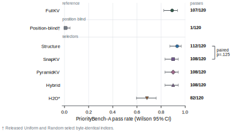
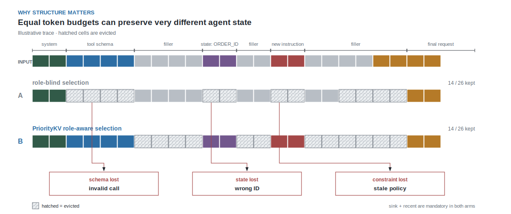
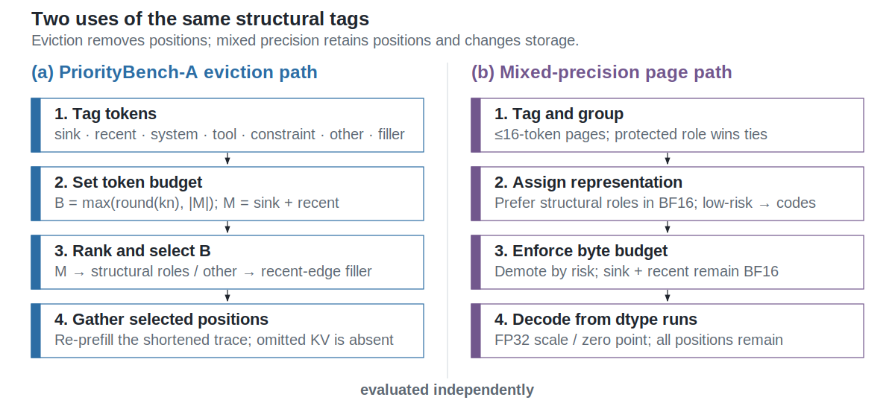

# PriorityKV

Agent traces make schema fields and pleasantries equally expensive to cache but very
unequal to lose. PriorityKV uses visible trace structure as a bounded eviction prior,
then evaluates INT4 quality and packed-system cost as separate questions.

**Arush Sharma** — IIT (ISM) Dhanbad · **Anupam Rawat** — IIT Bombay<br>
Apache-2.0 · Python 3.11–3.12 · Primary evaluation: Qwen3-8B on NVIDIA H200

| Headline | Result and claim boundary |
|---|---|
| Qwen eviction, 25% keep (`n=120`) | Structure **0.933** (112/120) vs uniform/random **0.008** (1/120 each): visible structure decisively beats blind eviction. |
| Matched attention selectors (`n=120`) | Structure **0.933** vs SnapKV/PyramidKV/hybrid **0.900**; McNemar **p=0.125**, so the four-example edge is not significant. |
| Model and budget transfer | Llama at 25% is ceiling-saturated; at 5%, SnapKV **1.000** beats structure **0.875 / 0.900** on both evaluated slices. |
| Matched INT4 placement (`n=240`) | FullKV **0.8875**, uniform **0.8792**, structure **0.8833**: role-aware INT4 does not separate quality. |
| Packed H200 path | Payload **0.719×** and peak **0.868×**, but E2E **1.11–1.12×** and TPOT **1.20–1.21×**: fewer bytes, higher latency. |

**Paper:** [compiled PDF](paper/prioritykv.pdf) ·
[LaTeX source](paper/prioritykv.tex) ·
[readable manuscript](paper/prioritykv_manuscript.md) ·
[PDF build instructions](paper/README.md)



## Why structure?

Agent traces place tool schemas, superseding instructions, persistent identifiers, tool
results, ordinary dialogue, and filler in one KV cache. PriorityKV asks whether the
application-visible role of a token should influence retention when the cache must shrink.
It tests eviction reliability separately from mixed-precision quality and systems cost.



## What is and is not claimed

The public claim boundary below is copied from
[`docs/EVIDENCE.md`](docs/EVIDENCE.md), the canonical claim registry:

> On PriorityBench-A (synthetic agent traces), structure-aware retention at a 25% keep budget far exceeds position-blind eviction on Qwen (P0 n=120: structure **0.933** vs uniform/random **~0.008**). Mid-context relocation ties FullKV on s0/s1/s2 (e.g. s0 both **0.975**); burying state hurts structure on all three slices (s0 **0.675** vs FullKV **0.900**; s1 **0.650** vs **0.875**; s2 **0.675** vs **0.900**) while uniform/random stay ~0 — so we do **not** claim structure beats FullKV. A CPU gold-span audit shows gold is **not** concentrated in sink+recent on Qwen or Llama (≈0–1% of gold tokens); structure keep retains essentially all gold tokens while uniform retains ≈0–1%, so the Qwen blind-eviction gap is retention-real, not a labeling leak into the always-kept window. Versus SnapKV-class selection on Qwen (n=120): structure **0.933** vs SnapKV/Pyramid/hybrid **0.900** (112/120 vs 108/120; McNemar **p=0.125**, not significant) — we claim only that it **matches or slightly exceeds** SnapKV-class methods while decisively beating position-only baselines. Hybrid did **not** beat SnapKV. Llama-3.1 at kf=0.25 is saturated among structure+attention arms (all **1.0**); the gold audit rules out “gold already in sink+recent” as the explanation — the task is too easy once any competent keep runs. At kf=0.05 SnapKV outperforms structure on **two** slices (s0: 1.0 vs 0.875; s1: 1.0 vs 0.900). P2 streamed-cold is a **smoke test** (~36 GiB peak in log), not a systems result.

Not claimed:

- Structure beats FullKV or SnapKV in general
- Significant structure≫SnapKV on Qwen
- Universal cross-model transfer to Llama
- Soft INT4 quality win; peak VRAM collapse; LongBench/RULER matrices

The additional frozen-core negative remains explicit: 75% INT4 placement does not create
a PriorityBench quality separation, and the current FlashInfer shim regresses TPOT.

## System at a glance

PriorityKV maps chat messages to token roles, forms 16-token pages, applies a matched
retention or precision budget, and stores hot pages in BF16 and cold pages as packed INT4
values plus scale metadata. The frozen decode path makes at most two FlashInfer calls per
layer and merges their log-sum-exp states. Cold pages are expanded into BF16 scratch for
attention; that limitation explains why payload savings do not translate one-for-one to
peak memory or speed.



## Evidence, paper, and reproducibility

| Resource | Purpose |
|---|---|
| [`docs/EVIDENCE.md`](docs/EVIDENCE.md) | Canonical claim registry and external-audit response |
| [`RESULTS.md`](RESULTS.md) | Frozen metrics and prior result tables |
| [`paper/prioritykv.tex`](paper/prioritykv.tex) | Handwritten standalone arXiv source |
| [`paper/prioritykv_manuscript.md`](paper/prioritykv_manuscript.md) | Readable synchronized manuscript |
| [`paper/README.md`](paper/README.md) | PDF build and packaging instructions |
| [`docs/DATASET.md`](docs/DATASET.md) | PriorityBench-A task and split specification |
| [`docs/REPRODUCIBILITY.md`](docs/REPRODUCIBILITY.md) | Local, artifact, and H200 reproduction levels |
| [`FINAL_RUN_MANIFEST.yaml`](FINAL_RUN_MANIFEST.yaml) | Frozen model, benchmark, config, and job IDs |

## Repository layout

```text
src/prioritybench/    deterministic benchmark generator and scorers
src/prioritykv/       role policies, packed cache, and FlashInfer decode
configs/              frozen experiment configurations
jobs/                 canonical H200 commands and result bundles
paper/                arXiv source, readable manuscript, and generated figures
scripts/              reproduction, audit, and figure-generation entrypoints
tests/                sub-project-local CPU and GPU contract tests
```

## Local reproduction

Install the CPU development environment and run the project-local checks:

```bash
git clone https://github.com/Arush777/Priority_KV.git
cd Priority_KV
./scripts/sync.sh
./scripts/check.sh
```

Regenerate and audit the locked benchmark:

```bash
PYTHONPATH=src uv run python scripts/mk_bench.py --mode w3_lock
PYTHONPATH=src uv run python scripts/audit_bench.py
```

Regenerate every publication SVG/PDF plus review PNGs:

```bash
uv run python scripts/make_publication_figures.py
```

Build the paper PDF:

```bash
cd paper
latexmk -pdf -interaction=nonstopmode -halt-on-error prioritykv.tex
```

## GPU reproduction

GPU dependencies are isolated from the CPU environment:

```bash
./scripts/sync.sh --cuda
export PRIORITYKV_SCRATCH=/data/anupam/scratch/prioritykv
```

Canonical commands and device assignments are indexed in
[`FINAL_RUN_MANIFEST.yaml`](FINAL_RUN_MANIFEST.yaml). Do not run GPU code on a login
node, and use no more than two H200 GPUs per job.

## Limitations

- PriorityBench-A is synthetic and agent-specific; it is not LongBench or RULER.
- The tagger uses visible role and template-like markers. Buried-state controls expose
  the boundary: structure loses to FullKV on all three slices.
- Attention baselines are matched-budget repository reimplementations, not reference-code
  runs; chunked H2O has a fidelity caveat.
- The Qwen structure–SnapKV difference is not significant (McNemar p=0.125).
- Llama at 5% keep reverses the Qwen ordering on both evaluated slices.
- Systems measurements are single-request; they do not establish serving throughput,
  concurrency behavior, or tail latency.
- Streamed-cold is a smoke test, and BF16 cold scratch limits peak-memory savings.

## Citation and license

Citation metadata is in [`CITATION.cff`](CITATION.cff). PriorityKV is licensed under the
[Apache License 2.0](LICENSE). Model weights, benchmark dependencies, and third-party
libraries retain their respective licenses. Author affiliations do not imply institutional
endorsement.

## Contributing

Read [`CONTRIBUTING.md`](CONTRIBUTING.md) before changing benchmark semantics, frozen
claims, or canonical run configurations. Security reports should follow
[`SECURITY.md`](SECURITY.md).
