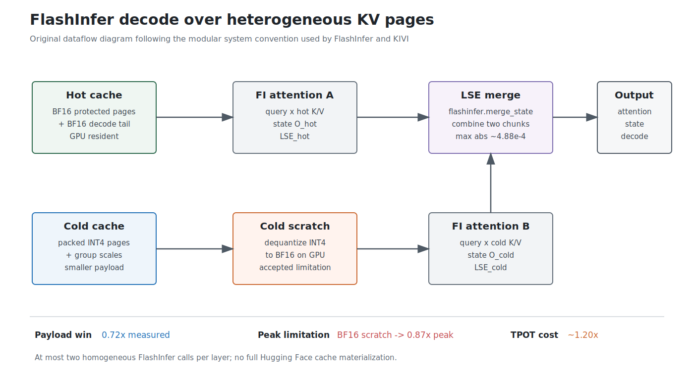
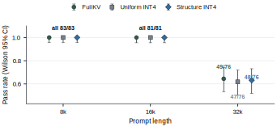
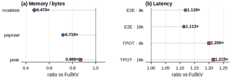

# PriorityKV: Structure-Aware KV Retention for Long Agent Traces

**Artifact version:** `SCIENCE_CORE_HOME_2026_07_19`
**Authors:** Arush Sharma (Indian Institute of Technology (Indian School of Mines)
Dhanbad); Anupam Rawart (Indian Institute of Technology Bombay)
**Author order:** Arush Sharma (first author), Anupam Rawart
**Primary model:** Qwen3-8B at revision `b968826d9c46dd6066d109eabc6255188de91218`
**Hardware:** NVIDIA H200; reduced secondary check on Gemma-2-9B-IT

## Abstract

Long language-model agent traces contain heterogeneous state: tool schemas, system
instructions, superseding constraints, identifiers, ordinary dialogue, and filler. All of
these tokens occupy the key-value (KV) cache, but losing them has different behavioral
consequences. We study whether cache allocation should use this known trace structure.
We introduce PriorityBench-A, a locked 240-example benchmark covering tool-schema
conformance, instruction supersession, and multi-turn state recall at 8k, 16k, and 32k
context strata. On matched-budget eviction stress slices, a role-blind sink-and-recent
policy scores 0.000 while structure-aware retention scores 1.000 at token granularity and
0.643 at 16-token page granularity. An adversarial buried-state variant lowers the
structure score to 0.429, identifying the boundary of the heuristic rather than an oracle
effect. We separately test mixed-precision storage and falsify the hypothesis that soft
INT4 quantization of 75% of positions creates a meaningful quality separation: on the
locked 240 examples, FullKV, role-blind mixed, and structure-aware mixed score 0.888,
0.879, and 0.883, respectively. We therefore treat quantization as a systems mechanism,
not a quality result. Our Qwen3-8B prototype stores BF16 and packed INT4 pages and uses
FlashInfer-backed decode on an H200. The structure-aware path uses 0.72x measured KV
payload and 0.87x peak allocated CUDA memory relative to FullKV, while end-to-end time
to first token is 1.11--1.12x and time per output token is 1.20--1.21x. The gap between
payload and peak is caused by an explicit INT4-to-BF16 cold-attention scratch buffer. The
result is a scoped measurement study: agent-trace structure is useful under eviction, soft
INT4 is quality-neutral at the tested operating point, and packed bytes do not
automatically imply a latency or peak-memory win.

## 1. Introduction

Autoregressive Transformer inference stores the keys and values of previous tokens so
that generation does not recompute the complete prefix. The resulting KV cache grows
with context length and batch size and is a central memory-management concern in LLM
serving [1, 2]. Existing work reduces this cost through paging, eviction, token selection,
or quantization [2--9]. These methods generally estimate token importance from position,
attention, or activation statistics.

Agent traces expose another signal before attention is evaluated: their protocol
structure. A serving layer often knows which spans are system instructions, tool schemas,
tool results, user constraints, or generated dialogue. A role-blind cache policy can
therefore satisfy a nominal token budget while deleting state that is necessary for the
agent's next action. Aggregate language-model metrics may not expose failures such as a
malformed tool call, compliance with an obsolete instruction, or use of the wrong order
identifier.

PriorityKV asks two questions:

1. At a matched eviction budget, does preserving protocol structure improve agent-task
   reliability over role-blind position policies?
2. If low-precision KV storage is quality-neutral, can a working mixed BF16/INT4 cache
   still provide measurable systems value?

These questions must remain separate. Eviction removes information; quantization retains
an approximation of it. Our initial expectation that role-aware INT4 placement would
create a quality gap was not supported at the selected 75% INT4 operating point. We keep
that negative result and evaluate the packed path in bytes and latency instead.

This report makes four contributions:

1. **PriorityBench-A:** a reproducible 240-example agent-reliability benchmark with
   deterministic scorers and a frozen manifest hash.
2. **Matched-budget eviction evidence:** structure-aware retention outperforms role-blind
   sink-and-recent and fixed-prefix controls on targeted stress slices, with an adversarial
   buried-state check that scopes the result.
3. **A falsified quality hypothesis:** uniform and structure-aware mixed INT4 policies
   remain close to FullKV on the locked 240-example evaluation.
4. **An auditable systems prototype:** packed BF16/INT4 pages, FlashInfer log-sum-exp
   state merging, phase-separated latency, and separate reporting of payload and peak
   memory on H200.

The report does not claim paper-grade generalization across LongBench or RULER, a
quantization-driven accuracy advantage, or a fused INT4 attention speedup.


Figure 1 uses the token-strip and left-to-right cache-workflow conventions common in
H2O [5], SnapKV [6], and KIVI [8], but depicts PriorityKV's distinct input signal and
allocation policy. Unlike attention-derived selection, PriorityKV begins with message-role
metadata already present in an agent trace.

## 2. Related Work

**KV memory management.** PagedAttention reduces fragmentation and enables flexible KV
sharing without changing which tokens are retained [2]. StreamingLLM observes the role of
attention sinks and combines initial tokens with a recent window [3]. We use this
sink-and-recent shape as a deliberately role-blind eviction control, not as a complete
reimplementation or evaluation of StreamingLLM.

**KV eviction and token selection.** Scissorhands retains tokens that were previously
important [4], while H2O balances heavy hitters with recent tokens [5]. SnapKV estimates
prompt importance from an observation window [6], and PyramidKV varies the budget across
layers [7]. These methods derive importance from model behavior. PriorityKV instead asks
whether application-visible message roles are useful when the workload is an agent trace.
The approaches are complementary: structural priors could be combined with attention-based
selection, but that combination is not evaluated here.

**KV quantization.** KIVI motivates asymmetric low-bit treatment of keys and values and
demonstrates that aggressive KV quantization can preserve downstream quality [8]. Our
INT4 path is not proposed as a replacement for KIVI or a new quantizer. It is a storage
and measurement vehicle for comparing role-aware and role-blind precision allocation.

**Serving and evaluation.** FlashInfer provides composable attention kernels and state
merging for heterogeneous serving workloads [9]. PriorityKV uses `merge_state` to combine
hot BF16 and dequantized cold attention results. LongBench and RULER provide broad
long-context evaluations [10, 11]. PriorityBench is narrower: it isolates deterministic
agent-state failures and should be read as a complementary diagnostic rather than a
general long-context benchmark.

## 3. PriorityBench-A

### 3.1 Tasks

PriorityBench-A contains 240 generated multi-turn conversations, with 80 examples in each
of three categories:

| Category | Required behavior | Scoring |
|---|---|---|
| Tool schema | Emit a valid call under an earlier tool contract | JSON parsing plus schema-subset checks |
| Instruction supersession | Follow the latest of conflicting constraints | Required and forbidden regular expressions |
| Multi-turn state | Reuse an earlier ID, path, or preference | Exact slot match |

Each conversation plants relevant state, adds benign filler, and ends with a request whose
correct answer depends on that state. Scoring is programmatic and does not use an
LLM-as-judge. The lock contains 83 examples at 8k, 81 at 16k, and 76 at 32k; the split
counts are 92 calibration, 49 validation, and 99 test. Stable hashing assigns splits.
The manifest SHA256 is
`fc44b966725738c94008ba61ce57ad7366169b9c0be73074f8161d909ccfae89`.

PriorityBench is synthetic by design. It offers controlled failure attribution and exact
scoring, but it does not estimate the frequency of these failures in production traffic.
The generator, templates, manifest, and scorers are included in the repository.

### 3.2 Adversarial variants

The initial templates often place short, gold-bearing turns before long filler. A policy
that simply prefers short or early spans can therefore appear semantic. We use two checks:

- **Buried state:** lengthen or bury gold-bearing turns so that short-turn tagging no
  longer identifies all state.
- **Middle relocation:** move the state block away from the prefix while preserving the
  leading system message and final request.

These variants exposed a real limitation: the basic structure policy preserves tool and
constraint roles more reliably than unmarked free-form state. We retain that failure in
the results.

## 4. Method

### 4.1 Structural roles

PriorityKV maps chat messages to page roles using information already available to an
agent serving stack. System messages are tagged as system, tool, or constraint spans;
tool messages and schema-like assistant messages are tagged as tool spans; constraint-like
user messages are tagged as constraints; and short state-bearing turns can be tagged as
other structured state. The first 16 tokens are protected as an attention sink and the
most recent 128 tokens are protected as a decode-local window.

The current tagger is a transparent heuristic over message roles, length, and a small set
of schema or constraint markers. It is not a learned importance model and does not inspect
the benchmark answer. A removed early implementation keyed on final-answer markup; the
buried-state and middle-relocation controls were added specifically to detect such leakage.

### 4.2 Matched-budget eviction

For a prompt of length `n` and keep fraction `k`, every arm receives the same nominal
budget `round(k n)`, subject to the common sink and recent minimum. The controls are:

- **Role-blind sink+recent:** retain the sink and then fill the budget from the recent
  edge.
- **Random:** retain the same mandatory region and sample the remaining pages.
- **Fixed prefix:** retain sink, recent, and the lowest-index pages.
- **Structure-aware:** retain sink, recent, and protected-role pages before filling the
  remaining budget near the recent edge.
- **Keep all:** retain the complete prompt as a wiring control.

Page experiments operate on contiguous 16-token pages. Token selection is applied by
gathering the retained prompt positions and regenerating the cache, avoiding an invalid
RoPE index substitution. These experiments isolate missing-state sensitivity; they are
not the packed mixed-precision serving path.

### 4.3 Matched mixed precision

The mixed policy assigns the same number of positions to INT4 in both arms. With
`int4_frac = 0.75`, sink and recent positions remain BF16. The role-blind arm spaces INT4
positions uniformly through the demotable region. The structure arm demotes filler and
low-risk roles first, spilling into protected roles only when required to meet the exact
budget.

For the frozen Qwen3-8B path, K and V are divided into 16-token pages. Hot pages store
BF16 tensors; cold pages store packed 4-bit values and per-group scale metadata. Packing
is real storage, not a fake-quantized BF16 tensor. The implementation reports both actual
payload bytes, including metadata, and an idealized 0.5-byte-per-element model.

### 4.4 FlashInfer decode

Prefill uses the native Hugging Face path. The cache is then split into hot BF16 pages and
cold packed pages. During decode, the Qwen3 attention shim performs at most two attention
calls per layer: one over coalesced hot pages and the decode tail, and one over cold pages
after dequantization. FlashInfer's log-sum-exp merge combines their attention states.
Parity tests reduced the maximum absolute merge error to approximately `4.88e-4` after
correcting an LSE-base mismatch.

The current implementation expands cold INT4 pages into a BF16 GPU scratch buffer before
attention. This avoids silently materializing a full Hugging Face cache but limits peak
memory savings and adds decode overhead. Direct fused or page-streamed INT4 attention is
future systems work.



Figure 2 follows the modular system-dataflow convention used by FlashInfer [9] and the
grouped/residual cache presentation used by KIVI [8]. It makes the temporary BF16 cold
scratch explicit because that allocation explains the difference between payload and peak
memory.

## 5. Experimental Setup

The primary experiments use Qwen3-8B in non-thinking greedy decode mode on NVIDIA H200
GPUs. The model revision, benchmark hash, configurations, job IDs, and job status are
frozen in `FINAL_RUN_MANIFEST.yaml`.

The evaluation families answer different questions:

| Family | Size | Purpose |
|---|---:|---|
| Matched-keep stress | 14--16 examples per configuration | Controlled eviction sensitivity and policy ablations |
| Lock-240 mixed quality | 240 examples | Quality of FullKV and matched 75% INT4 placement |
| D4 latency | 18 examples, 9 per 8k/16k stratum | Pack, cold-scratch, TTFT, and TPOT measurement |
| Peak and payload | 18 examples | Allocated/reserved CUDA peak and cache payload |
| Gemma reduced | 14 examples at approximately 8k | Directional second-model check only |

Latency rows use 128 generated tokens, greedy decoding, one warm-up sequence, and three
timing repeats whose median is recorded. FullKV uses SDPA; mixed arms use the FlashInfer
shim. This is a single-request prototype comparison, not a throughput or concurrency
study. The FP8 publish job uses a different batch-amortized timing protocol and is
therefore retained as a pass/fail secondary check rather than merged into the main
latency table.

## 6. Results

### 6.1 Structure matters under eviction

| Setting | n | Full/keep-all | Role-blind | Random/fixed prefix | Structure |
|---|---:|---:|---:|---:|---:|
| Token keep, `k=0.25` | 14 | 1.000 | 0.000 | random 0.000 | **1.000** |
| Page keep, `k=0.15` | 14 | 1.000 | 0.000 | random 0.071 | **0.643** |
| Page keep, `k=0.25` | 14 | 1.000 | 0.000 | random 0.286 | **0.643** |
| Page keep, `k=0.35` | 14 | 1.000 | 0.000 | random 0.429 | **0.643** |
| Buried token state, `k=0.25` | 14 | 1.000 | 0.000 | random 0.000 | **0.429** |
| Middle-relocated page state, `k=0.25` | 16 | 1.000 | 0.000 | fixed prefix 0.125 | **0.688** |

The same 14-example slice is reused across the page-budget sweep, so the rows are an
ablation rather than independent replications. The uniform arm's zero score shows that
the sink-and-recent policy removes required middle state at these aggressive budgets.
The structure arm's 0.643 plateau and buried-state drop are equally important: explicit
roles rescue a subset of failures, but the heuristic does not identify all free-form
multi-turn state. Middle relocation separates structure from the fixed-prefix control,
showing that the result is not solely early-position retention.


### 6.2 Soft INT4 does not create a quality separation

| Arm | Score, n=240 | Difference from FullKV |
|---|---:|---:|
| FullKV | **0.8875** | -- |
| Role-blind mixed INT4 | **0.8792** | -0.0083 |
| Structure-aware mixed INT4 | **0.8833** | -0.0042 |

The structure and role-blind arms differ by 0.0042, equivalent to one aggregate success
on this 240-example benchmark. We do not interpret that difference as evidence of a
structure-aware quantization quality advantage. At 8k and 16k, all three arms score 1.0.
At 32k, FullKV itself falls to 0.645, while role-blind and structure-aware mixed score
0.618 and 0.632. The primary conclusion is negative: retaining an INT4 approximation of
75% of positions is much less destructive than evicting those positions.



### 6.3 Packed storage reduces bytes, not latency

| Context | Structure pack | Cold scratch | E2E / FullKV | TPOT / FullKV | Score |
|---|---:|---:|---:|---:|---:|
| 8k | 34.8 ms | 14.2 ms | 1.118x | 1.200x | 1.000 |
| 16k | 48.1 ms | 19.7 ms | 1.113x | 1.215x | 0.889 |

The mixed path is close to FullKV in end-to-end latency because prefill dominates these
single-request traces, but it is approximately 20% slower per output token. This is a
latency cost, not a speedup. Packing and cold-scratch construction cost tens of
milliseconds per sequence.

Across the 18-example memory slice, FullKV allocates 23.61 GB at peak and the
structure-aware mixed path allocates 20.50 GB, a ratio of 0.868. Actual mixed payload is
1.679 GB versus a 2.336 GB BF16 cache model, a ratio of 0.719. The idealized bit model is
0.473. The smaller payload does not translate one-for-one into peak reduction because the
cold attention path temporarily expands INT4 pages to BF16.



### 6.4 Secondary model check

On a reduced 14-example Gemma-2-9B-IT check at approximately 8k, FullKV, structure, and
role-blind eviction score 0.357, 0.143, and 0.000. This supports only the direction
`structure >= role-blind` under the tested stress. The absolute values are not comparable
to the Qwen lock because the prompt/scorer design and length cap were tuned around Qwen.

## 7. Discussion

The experiments support a narrow design principle: when an application already knows
the protocol role of a span, discarding that information before cache allocation is
unnecessary. Message roles are cheap, deterministic priors that can protect tool and
instruction state when attention-only importance estimates are unavailable or stale.

The results also show why eviction and quantization should not be grouped under a single
"compression quality" claim. In our setup, removing 75% of tokens destroys the targeted
agent behaviors, while representing approximately 75% of positions in INT4 leaves the
aggregate result near FullKV. A mixed-precision policy should therefore be justified by
memory and kernel behavior unless a harder quality regime demonstrates otherwise.

Finally, payload accounting is not a proxy for deployed memory or performance. The
prototype stores fewer bytes but re-expands cold pages for attention. A production
implementation would need fused low-bit attention or bounded page streaming, allocator
analysis under concurrency, and integration into a serving scheduler before claiming
capacity or throughput gains.

## 8. Limitations and Threats to Validity

1. **Synthetic benchmark.** PriorityBench provides controlled, deterministic failures but
   is not sampled from production agent traffic.
2. **Small positive-result slices.** The decisive eviction experiments use 14--16
   examples. The 240-example run evaluates mixed INT4 quality, not matched eviction.
3. **One primary model and device.** Qwen3-8B on H200 is the only complete matrix. The
   Gemma check is reduced and low-scoring.
4. **Heuristic structure labels.** Free-form state without recognizable roles remains a
   failure mode. Structural metadata can also be missing or incorrect in real systems.
5. **Limited baselines.** Role-blind sink/recent, random, fixed-prefix, FP8, and a reduced
   SnapKV attempt do not constitute a full comparison with H2O, SnapKV, PyramidKV, or
   state-of-the-art KV quantizers.
6. **Prototype timing.** Measurements cover single-request latency, not batching,
   concurrency, throughput, or tail latency. FullKV SDPA and mixed FlashInfer are not a
   kernel-isolated comparison.
7. **Cold scratch.** INT4-to-BF16 expansion limits the realized peak-memory reduction and
   causes the measured TPOT regression.
8. **No uncertainty from repeated jobs.** Per-example timing medians reduce local noise,
   but canonical jobs were not repeated across independent machine runs.

PriorityBench contains generated tool contracts and synthetic identifiers rather than
personal data. The main foreseeable misuse is overgeneralizing the benchmark to claim
production reliability; the frozen claim and public limitations are intended to prevent
that interpretation.

## 9. Reproducibility

The repository records:

- benchmark generator, templates, scorers, manifest, and SHA256 audit;
- exact Qwen3-8B model revision and non-thinking generation settings;
- frozen YAML configurations and job commands;
- raw summaries, logs, and GPU snapshots for the main latency, memory, quality, and Gemma
  jobs;
- CPU unit tests for policies, packed storage, quantization, page management, and
  FlashInfer state logic; and
- `FINAL_RUN_MANIFEST.yaml` as the claim and artifact index.

Generate and audit the locked dataset with:

```bash
PYTHONPATH=src uv run python scripts/mk_bench.py --mode w3_lock
PYTHONPATH=src uv run python scripts/audit_bench.py
```

Regenerate the paper figures from frozen artifacts with:

```bash
uv run python scripts/make_publication_figures.py
```

GPU reproduction requires the pinned model weights, the `gpu` optional dependency set,
and an H200-class CUDA environment. Canonical commands and result bundles are documented
under `jobs/` and in `docs/REPRODUCIBILITY.md`.

## 10. Conclusion

PriorityKV demonstrates that known agent-trace structure is a useful cache-allocation
signal under aggressive eviction. It does not demonstrate that role-aware soft INT4
placement improves quality, and it does not hide that the current packed implementation
is slower per decoded token. The complete result is therefore a measurement result rather
than a universal cache-compression claim: preserve protocol-critical state when dropping
KV, use low precision for bytes when quality permits, and measure payload, peak, and
latency as separate quantities.

## References

1. Vaswani et al. *Attention Is All You Need.* NeurIPS, 2017.
2. Kwon et al. *Efficient Memory Management for Large Language Model Serving with
   PagedAttention.* SOSP, 2023. https://arxiv.org/abs/2309.06180
3. Xiao et al. *Efficient Streaming Language Models with Attention Sinks.* ICLR, 2024.
   https://arxiv.org/abs/2309.17453
4. Liu et al. *Scissorhands: Exploiting the Persistence of Importance Hypothesis for LLM
   KV Cache Compression at Test Time.* NeurIPS, 2023.
   https://arxiv.org/abs/2305.17118
5. Zhang et al. *H2O: Heavy-Hitter Oracle for Efficient Generative Inference of Large
   Language Models.* NeurIPS, 2023. https://arxiv.org/abs/2306.14048
6. Li et al. *SnapKV: LLM Knows What You Are Looking for Before Generation.* NeurIPS,
   2024. https://arxiv.org/abs/2404.14469
7. Cai et al. *PyramidKV: Dynamic KV Cache Compression Based on Pyramidal Information
   Funneling.* https://arxiv.org/abs/2406.02069
8. Liu et al. *KIVI: A Tuning-Free Asymmetric 2bit Quantization for KV Cache.* ICML,
   2024. https://arxiv.org/abs/2402.02750
9. Ye et al. *FlashInfer: Efficient and Customizable Attention Engine for LLM Inference
   Serving.* https://arxiv.org/abs/2501.01005
10. Bai et al. *LongBench: A Bilingual, Multitask Benchmark for Long Context
    Understanding.* ACL, 2024. https://arxiv.org/abs/2308.14508
11. Hsieh et al. *RULER: What's the Real Context Size of Your Long-Context Language
    Models?* COLM, 2024. https://arxiv.org/abs/2404.06654
12. Yang et al. *Qwen3 Technical Report.* https://arxiv.org/abs/2505.09388
