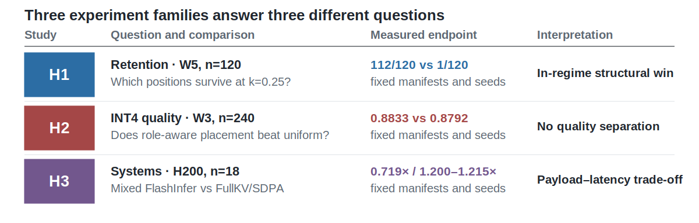
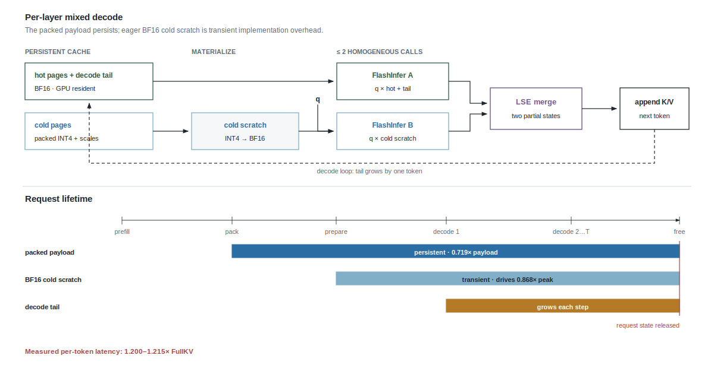
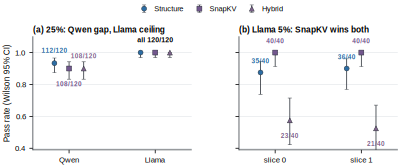

# PriorityKV: Structure-Aware KV Retention for Long Agent Traces

**Authors:** Arush Sharma, Indian Institute of Technology (Indian School of Mines)
Dhanbad; Anupam Rawat, Indian Institute of Technology Bombay<br>
**Primary hardware:** NVIDIA H200

## Abstract

Long agent traces pack tool schemas, persistent identifiers, superseding instructions,
and filler into one key–value (KV) cache. Every token has the same storage cost, but not
the same failure cost: losing a schema field can break a tool call, while losing filler
changes nothing. We test whether visible trace structure is a useful prior for deciding
what to evict. On a synthetic stress benchmark with Qwen3-8B and a matched 25% keep
budget, structure-aware retention passes 112/120 examples, compared with 1/120 for both
uniform and random eviction. It matches or slightly exceeds repository
reimplementations of SnapKV, PyramidKV, and a structure–SnapKV hybrid, each at 108/120,
although the paired advantage over SnapKV is not significant (exact two-sided McNemar
p=0.125).

We also report where the idea fails. Placement controls show that structure ties, rather
than beats, FullKV when state is moved to the middle and loses when state is buried in
free-form text. On Llama-3.1-8B at a 5% budget, SnapKV wins on both evaluated slices. A
separate mixed-precision study finds no quality benefit from role-aware INT4 placement.
The packed BF16/INT4 prototype reduces measured KV payload to 0.719× FullKV, but BF16
cold scratch raises time per output token to 1.200–1.215×. The result supports visible
agent structure as a scoped eviction prior, not as a universal selector, an INT4 quality
win, or a latency win.

## 1. Introduction

Forty turns into an illustrative agent conversation, the model emits a tool call without
a required field. The field belonged to a schema that the cache evicted thirty turns
earlier to stay under budget; byte for byte, it looked no different from the filler that
survived. This is the failure PriorityKV targets. In an agent trace, a JSON schema field
and a throwaway pleasantry cost the same storage but not the same failure. Losing the
former can also resurrect an obsolete instruction or substitute the wrong identifier.

Autoregressive inference stores prior keys and values so each decode step can reuse the
prefix. The cache grows with sequence length and constrains serving capacity [1, 2].
Existing work reduces that cost through paging, streaming windows, attention-derived
eviction, or quantization [3–7]. Agent traces add a signal those methods do not directly
use: serialization already exposes message roles, tool contracts, constraints, results,
and persistent state.


**Figure 1 — equal storage cost, unequal failure cost.** Two policies keep the same
illustrative 14/26-token budget. Hatched cells are evicted; callouts show failure modes,
not empirical counts.

PriorityKV asks whether application-visible structure is useful when a cache must
discard tokens, and separately whether a mixed BF16/INT4 implementation can save bytes.
These are different hypotheses: eviction removes information, whereas quantization
retains an approximation. Combining their outcomes into one “compression quality” claim
would conceal the falsified INT4 hypothesis and the measured latency cost.



**Figure 2 — three questions, three verdicts.** Eviction reliability, precision
placement, and systems performance are evaluated independently.

**Scope of claims.** The paper separates those three questions because a result in one
family does not establish either of the others. The baselines are matched-budget
repository reimplementations, the benchmark is synthetic, and the systems measurements
are single-request prototype results. Section 8 collects the remaining limitations.

The contributions are:

1. PriorityBench-A, a deterministic synthetic benchmark for tool-schema conformance,
   instruction supersession, and multi-turn state recall, together with disjoint stress
   slices, placement controls, and a gold-span retention audit.
2. A Qwen eviction comparison at n=120 with matched-budget attention baselines and a
   paired McNemar test. The supported claim is that structure matches or slightly
   exceeds SnapKV-class selection while decisively beating position-only baselines; it
   is not that structure beats FullKV or SnapKV in general.
3. Two prominent negatives: structure loses to SnapKV on both Llama slices at a 5%
   budget, and structure-aware placement of 75% INT4 positions does not create a quality
   advantage on the locked Qwen benchmark.
4. Packed BF16/INT4 pages and two-call FlashInfer decode with payload, allocator peak,
   packing, cold-scratch, end-to-end, and per-output-token measurements reported
   separately.

## 2. Related Work

**Paging and streaming.** PagedAttention separates logical KV blocks from
non-contiguous physical storage to reduce fragmentation and enable sharing; it does not
choose semantic tokens to retain [2]. StreamingLLM identifies attention sinks and
combines initial tokens with a recent window for streaming language modeling [3].
PriorityKV uses sink plus recent as a mandatory region and the shape of its position-only
control, not as a claim to reproduce StreamingLLM's streaming setting.

**Eviction and attention-derived selection.** H2O retains accumulated-attention heavy
hitters together with recent tokens [4]. SnapKV uses an observation window near the end
of the prompt to select clustered prefix features [5]. PyramidKV varies the cache budget
across layers in response to pyramidal information funneling [6]. The comparison uses repository
reimplementations at matched token budgets, not the authors' reference code. H2O is a
chunked SDPA reimplementation and has a fidelity caveat. A hybrid that protects
structural tokens and fills the remainder with SnapKV equals SnapKV on Qwen at 25% keep
and collapses below both parents on the two Llama 5% slices. The complementarity
hypothesis is therefore not supported.

**KV quantization and attention engines.** KIVI motivates asymmetric group-wise
low-bit KV quantization and keeps residual tokens at full precision [7]. PriorityKV's
INT4 path is not a new quantizer or KIVI replacement. FlashInfer exposes composable
attention kernels and log-sum-exp state merging for heterogeneous KV layouts [8].
PriorityKV uses that merge contract while retaining an explicit BF16 cold-scratch
limitation.

**Long-context evaluation.** LongBench and RULER cover broad long-context capabilities
[9, 10]. PriorityBench-A is intentionally narrower: it provides exact failure
attribution for synthetic agent protocols and cannot replace a general long-context
suite.

## 3. PriorityBench-A

### 3.1 Tasks and scoring

PriorityBench-A generates multi-turn chats in which an early span contains state
required by a final request and intervening turns provide benign filler. Scoring is
binary and programmatic; no LLM judge is used.

| Category | Required behavior | Deterministic scorer |
|---|---|---|
| Tool schema | Emit a valid call under an early contract | JSON/schema subset |
| Instruction supersession | Follow the latest conflicting constraint | Required/forbidden regex |
| Multi-turn state | Reuse an earlier ID, path, or preference | Exact slot match |

Two manifests from the same PriorityBench-A generator serve different studies. The
locked 240-example manifest (W3) contains 83, 81, and 76 examples at nominal 8k, 16k,
and 32k; stable hashing assigns 92 calibration, 49 validation, and 99 test examples.
The 120-example stress manifest (W5) is split evenly across the three categories and
8k/16k strata, with three disjoint 40-example slices. Section 9 records both digests.

### 3.2 Placement and leakage controls

The generator's visible templates are a threat: a heuristic tagger can appear semantic
if gold state is consistently short, early, or visibly marked. Middle relocation moves
state away from the prefix while retaining the leading system message and final request.
Buried state lengthens or embeds state-bearing turns so a short-span heuristic does not
protect all gold.

A separate CPU audit maps gold-bearing messages into tokenizer spans and intersects them
with selected positions. It measures the gold fraction already in sink plus recent and
the fraction retained by each policy without using model outputs.

## 4. Method

### 4.1 Roles and matched-budget retention

For tokenized trace x₁:ₙ and keep fraction k, the nominal budget is
`B(n,k)=round(kn)`. The mandatory set is `M = sink ∪ recent`, with the first 16
tokens and last 128 tokens protected. Every evaluated token-level compressed arm selects
`A ⊇ M` with `|A| = max(B, |M|)`.

Uniform retention uses the mandatory sink and fills from the recent edge. Random keeps M
and samples the remaining budget. Structure first includes system, tool, constraint, and
other state-bearing positions, then fills residual budget from the recent edge. Whole-page
experiments apply the same priority while respecting page boundaries.

The tagger consumes message roles and transparent schema or constraint markers. It does
not inspect benchmark answers or future attention.

### 4.2 Pages and mixed precision

Physical page size is P=16 tokens. In the mixed-precision study, every position remains
present and an exact target fraction f=0.75 is stored as INT4, subject to common
sink/recent BF16 protection. The role-blind arm spaces INT4 positions across the
demotable region. Structure demotes filler, generated, and low-risk positions first.
Both arms have the same number of INT4 positions.


**Figure 3 — PriorityKV architecture.** Chat metadata becomes token roles and 16-token
pages before matched-budget retention or precision placement.

### 4.3 Two-call FlashInfer decode

Prefill uses the native Hugging Face path. The cache is partitioned into coalesced hot
BF16 pages and packed cold pages. Before the frozen full-scratch decode measurement,
cold pages are dequantized into BF16 GPU scratch. Each layer makes at most two
homogeneous FlashInfer calls: one over hot pages plus decode tail and one over cold
scratch. Outputs and native log-sum-exp states are combined with `merge_state`. A parity
artifact records maximum absolute error of approximately 4.88e-4.



**Figure 4 — decode path and allocation lifetime.** Two homogeneous FlashInfer calls
are merged through log-sum-exp state; packed payload persists while BF16 cold scratch is
live during decode.

The streamed-cold experiment (P2) instead dequantizes chunks and releases them after
merging. Its three-example run is only a successful smoke test.

## 5. Experimental Design

All GPU experiments use greedy decoding on NVIDIA H200 hardware. Canonical jobs use at
most two GPUs; each eviction, attention-baseline, and transfer job uses one. Section 9
records pinned model revisions, manifest digests, and result bundles.

### 5.1 Eviction, attention baselines, and placement controls

The eviction and placement study (P0) evaluates Qwen on the 120-example stress manifest,
divided into three disjoint 40-example slices and balanced across 8k and 16k contexts.
At token keep k=0.25 it compares structure, uniform, random, keep-all, and a separately
recorded FullKV run. Middle-relocation and buried-state transformations cover all three
slices. The attention-baseline comparison (P1) reuses the same examples and budget for
repository reimplementations of SnapKV, PyramidKV, H2O, and a structure–SnapKV hybrid.
SnapKV uses a 64-token observation window and kernel size five. H2O is a chunked SDPA
reimplementation. A tracked artifact supplies the exact paired McNemar test.

### 5.2 CPU retention audit

The audit runs the Qwen and Llama tokenizers on the three stress slices per model
(n=120 each) at k=0.25. It reports descriptive gold-token fractions rather than model
accuracy; no binomial interval or significance test is attached.

### 5.3 Mixed-precision quality and systems measurements

The locked mixed-precision study evaluates all 240 Qwen examples: 83 at 8k, 81 at 16k,
and 76 at 32k. FullKV, uniform-mixed, and structure-mixed use matched f=0.75 INT4
placement for the mixed arms. This tests precision placement, not eviction.

The latency measurement uses nine 8k and nine 16k examples, 128 generated tokens, one
warm-up, and three timing repetitions summarized by per-example medians. FullKV uses
SDPA; the packed path uses the FlashInfer shim. The memory measurement uses 18 examples.
Both are single-request studies, and the canonical jobs were not independently repeated.
A three-example streamed-cold run is smoke only.

### 5.4 Cross-model transfer and weak checks

The Llama transfer study (P3) evaluates the structure and attention arms on all three
stress slices at k=0.25 (n=120). At k=0.05, only the first two slices are run (n=40
each); no uniform Llama arm is available. Secondary checks reuse one 14-example Qwen
slice across three whole-page budgets and evaluate 14 Gemma-2-9B-IT examples with
Qwen-tuned prompts.

## 6. Results

### 6.1 Structure protects state that blind eviction drops


**Figure 5 — matched-budget Qwen comparison.** Points show pass rates with Wilson 95%
intervals, with exact counts aligned at right; the paired structure–SnapKV McNemar
p-value is 0.125. H2O* is the chunked repository reimplementation.

| Arm | Passes | Rate | Wilson 95% interval |
|---|---:|---:|---:|
| FullKV | 107/120 | 0.892 | [0.823, 0.936] |
| Structure | 112/120 | 0.933 | [0.874, 0.966] |
| Uniform | 1/120 | 0.008 | [0.002, 0.046] |
| Random | 1/120 | 0.008 | [0.002, 0.046] |
| SnapKV | 108/120 | 0.900 | [0.833, 0.942] |
| PyramidKV | 108/120 | 0.900 | [0.833, 0.942] |
| Hybrid | 108/120 | 0.900 | [0.833, 0.942] |
| H2O (chunked) | 82/120 | 0.683 | [0.596, 0.760] |

Middle relocation yields 115/120 for both structure and FullKV, 0.958 with Wilson
[0.906, 0.982]. Buried state yields 80/120 for structure, 0.667 [0.578, 0.745],
versus 107/120 for FullKV, 0.892 [0.823, 0.936].

| Slice | Middle: structure / FullKV / uniform | Buried: structure / FullKV / uniform |
|---|---:|---:|
| 0 | 0.975 / 0.975 / 0.025 | 0.675 / 0.900 / 0.000 |
| 1 | 0.950 / 0.950 / 0.050 | 0.650 / 0.875 / 0.000 |
| 2 | 0.950 / 0.950 / 0.000 | 0.675 / 0.900 / 0.000 |

The placement result prevents a structure-over-FullKV claim.

### 6.2 Structure matches attention selection; the hybrid does not help

The paired structure–SnapKV artifact records b=4 and c=0; exact two-sided McNemar
p=0.125. The difference is not significant. Hybrid equals SnapKV and does not support
complementarity. H2O passes 82/120 using the chunked implementation, so the comparison
does not establish a reference-code H2O result.

**Retention audit.** The audit confirms that the eviction gap is not an artifact of the
always-kept window.

| Model | Slice | Gold in sink+recent | Structure kept | Uniform kept |
|---|---|---:|---:|---:|
| Qwen | 0 | 0.010 | 1.000 | 0.010 |
| Qwen | 1 | 0.013 | 1.000 | 0.013 |
| Qwen | 2 | 0.010 | 1.000 | 0.010 |
| Llama | 0 | 0.000 | 1.000 | 0.000 |
| Llama | 1 | 0.000 | 1.000 | 0.000 |
| Llama | 2 | 0.000 | 1.000 | 0.000 |

Only about 0–1% of gold is already in sink plus recent. Structure retains all mapped
gold; uniform retains only the gold already in that window. The Qwen gap is
retention-real, and the Llama ceiling is not explained by gold already being mandatory.

### 6.3 The advantage depends on model and budget



**Figure 6 — budget and model dependence.** Qwen and Llama k=0.25 use n=120;
each Llama k=0.05 condition uses n=40. Error bars are Wilson 95% intervals.

All five structure and attention arms pass 120/120 at Llama k=0.25. With no uniform
arm, this is an easy-task ceiling rather than evidence of universal transfer. At
k=0.05, SnapKV passes 40/40 on both slices while structure passes 35/40 and 36/40.
Hybrid falls to 23/40 and 21/40. No paired Llama test was produced.

Failures at the tighter budget concentrate in tool-schema tasks: structure passes 8/13
and 9/13 in the first and second slices, versus SnapKV at 13/13 in both. Hybrid passes
only 1/13 and 0/13. Protecting broad structural spans can consume too much residual
budget, and simply unioning role and attention selections does not make them
complementary.

### 6.4 Matched INT4 placement does not separate quality


**Figure 7 — matched INT4 quality.** Qwen3-8B FullKV and matched f=0.75 mixed arms by
context stratum; error bars are Wilson 95% intervals.

| Arm | Passes | Rate | Wilson 95% interval |
|---|---:|---:|---:|
| FullKV | 213/240 | 0.8875 | [0.841, 0.922] |
| Uniform mixed | 211/240 | 0.8792 | [0.832, 0.915] |
| Structure mixed | 212/240 | 0.8833 | [0.837, 0.918] |

At 8k and 16k every arm is 1.0. At 32k, FullKV, uniform, and structure are
49/76, 47/76, and 48/76. The tested role-aware INT4 quality hypothesis is falsified.

### 6.5 Packed bytes incur scratch and latency costs


**Figure 8 — H200 systems trade-off.** Packed payload is smaller than FullKV,
allocator peak falls less, and each measured latency ratio exceeds the 1.0 reference.

Modeled, measured-payload, and allocated-peak ratios are 0.473×, 0.719×, and 0.868×.
At 8k, structure packing and scratch take 34.8 and 14.2 ms; E2E is 1.118× and TPOT
rises from 25.25 to 30.29 ms (1.200×). At 16k, pack and scratch take 48.1 and
19.7 ms; E2E is 1.113× and TPOT rises from 23.84 to 28.95 ms (1.215×). These are
regressions, not speedups.

The streamed-cold run exits successfully with parity and approximately 36.4 GiB peak in
its log, but with three examples and no comparative frontier it remains smoke only.

### 6.6 Additional weak checks

A whole-page Qwen ablation reuses the same 14 examples at 15%, 25%, and 35% keep.
Structure remains 9/14 at each budget; random rises from 1/14 to 6/14, and the
role-blind arm remains 0/14. On a separate 14-example Gemma check, FullKV passes 5/14,
structure 2/14, and uniform 0/14. The reused Qwen slice, low Gemma FullKV score,
Qwen-tuned prompts, and small samples make both results directional checks.

## 7. Discussion

**Structure is a prior, not an oracle.** The eviction results and retention audit show that visible
protocol structure can protect state a sink/recent or random budget discards. Middle and
buried controls qualify the result: when state remains recognizable, structure ties
FullKV; when embedded in longer free-form turns, structure loses.

**The advantage depends on model and budget.** Qwen at 25% strongly separates structure
from position-only policies and places it within four paired successes of SnapKV. Llama
at 25% cannot differentiate competent selectors; at 5%, SnapKV is better on both slices.
Tool-schema failure at that extreme budget suggests role protection can be too coarse
within a broad protected span.

**Hybrid complementarity is falsified.** Hybrid equals SnapKV on Qwen and is below both
parents on Llama at 5%. Unioning protected and attention-ranked positions changes the
residual budget and can inherit both rules' weaknesses.

**Bytes, peak, and speed differ.** Packed values and scale metadata genuinely reduce
payload. Full-layer BF16 scratch expands the working set and adds preparation and decode
cost. The observed 0.719× payload, 0.868× peak, and roughly 1.20× TPOT are mutually
consistent, but do not establish throughput or capacity under concurrency.

## 8. Limitations and Threats to Validity

1. **Synthetic workload.** PriorityBench-A is generated from controlled templates and
   exact scorers. It does not estimate deployment prevalence and is not LongBench/RULER.
2. **Tagger–generator alignment.** The tagger uses visible role, length, and marker
   signals resembling generator templates. The gold audit rules out leakage into
   sink+recent but not all template alignment. Buried structure scores
   0.675/0.650/0.675 versus FullKV 0.900/0.875/0.900.
3. **Baseline fidelity.** SnapKV, PyramidKV, H2O, and hybrid are repository
   reimplementations, not reference runs. Chunked H2O is particularly approximate.
4. **Statistical scope.** Qwen structure–SnapKV is not significant (p=0.125). Jobs are
   single canonical runs, not independent machine replications. Llama has no paired test.
5. **Model and budget scope.** Qwen3-8B is primary. Llama gives a ceiling and negative
   crossover, not universal transfer. Gemma is a low-scoring n=14 check.
6. **Systems scope.** FullKV SDPA and mixed FlashInfer are different backends.
   Measurements exclude batching, concurrent serving, throughput, and tails. Streamed-cold is smoke
   only; payload is not peak because cold attention expands INT4 into BF16.

## 9. Reproducibility

| Item or claim | Revision, digest, or artifact / job |
|---|---|
| Qwen3-8B revision | `b968826d9c46dd6066d109eabc6255188de91218` |
| Llama-3.1-8B revision | `0e9e39f249a16976918f6564b8830bc894c89659` |
| Locked 240-example manifest | SHA256 `fc44b966725738c94008ba61ce57ad7366169b9c0be73074f8161d909ccfae89` |
| Stress 120-example manifest | SHA256 `154c07b900a7be6a26a0381b0fa28d49e0847086eade0b98e9472663b578784f` |
| P0 plain | `p0_w5_s{0,1,2}_kf25_token_*` |
| Middle/buried controls | `p0{a,b,c,d,e,f}_*/summary.json` |
| P1 attention baselines | `p1_attn_baselines_s{0,1,2}_kf25_*` |
| H2O 0.683 | `p1_h2o_chunked_s0_kf25_gpu1_r1` plus P1 s1/s2 |
| McNemar p=0.125 | `jobs/results/p1_structure_vs_snapkv_mcnemar.json` |
| Retention audit | `audit_retention_{qwen,llama}_s{0,1,2}_kf25_summary.json` |
| Llama k=0.25 | `p3_llama31_attn_s{0,1,2}_kf25_*` |
| Llama k=0.05 | `p3_llama31_attn_s{0,1}_kf05_*` |
| Locked INT4 | `mg_b_lock240_quality_gpu01_r1` |
| Payload/peak | `mg_a_peak_mem_gpu5_r1` |
| Latency | `d4_latency_m3c_gpu56_r1` |
| P2 smoke | `p2_fi_stream_cold_16k_gpu1_r1` |
| Gemma | `pub_c_gemma_reduced_gpu01_r6` |
| Legacy page sweep | `docs/atlas_w4_structure_rows.jsonl` |

Regenerate the complete figure suite with:

```bash
uv run python scripts/make_publication_figures.py
```

Build the paper from `paper/` with:

```bash
latexmk -pdf -interaction=nonstopmode -halt-on-error prioritykv.tex
```

The TeX source uses `\graphicspath{{figures/}{paper/figures/}}`, so figures also resolve
when the repository root is the Overleaf project root.

## 10. Conclusion

On synthetic Qwen agent traces, visible structure is a strong retention prior against
position-blind eviction and matches or slightly exceeds the tested SnapKV-class
reimplementations at a 25% budget, without a significant paired advantage. It does not
beat FullKV under placement controls, transfer universally to Llama at a 5% budget, or
combine complementarily with SnapKV in the tested hybrid. The separate mixed-precision
study falsifies a role-aware INT4 quality win. Packed storage reduces payload, but BF16
scratch limits peak reduction and produces a TPOT regression. The bounded conclusion is:
use application-visible structure when state must be discarded, and measure precision,
payload, peak, and latency as separate hypotheses. When a constrained cache must choose,
retain the schema field before the pleasantry.

## References

1. Vaswani et al. *Attention Is All You Need.* Advances in Neural Information Processing
   Systems 30, 2017.
2. Kwon et al. *Efficient Memory Management for Large Language Model Serving with
   PagedAttention.* 29th ACM Symposium on Operating Systems Principles, 2023.
   doi:10.1145/3600006.3613165.
3. Xiao et al. *Efficient Streaming Language Models with Attention Sinks.* ICLR, 2024.
4. Zhang et al. *H2O: Heavy-Hitter Oracle for Efficient Generative Inference of Large
   Language Models.* Advances in Neural Information Processing Systems 36, 2023.
5. Li et al. *SnapKV: LLM Knows What You Are Looking for Before Generation.* NeurIPS,
   2024. doi:10.52202/079017-0722.
6. Cai et al. *PyramidKV: Dynamic KV Cache Compression Based on Pyramidal Information
   Funneling.* arXiv:2406.02069, 2024.
7. Liu et al. *KIVI: A Tuning-Free Asymmetric 2bit Quantization for KV Cache.* ICML,
   PMLR 235:32332–32344, 2024.
8. Ye et al. *FlashInfer: Efficient and Customizable Attention Engine for LLM Inference
   Serving.* Proceedings of Machine Learning and Systems 7, 2025.
9. Bai et al. *LongBench: A Bilingual, Multitask Benchmark for Long Context
   Understanding.* ACL, pages 3119–3137, 2024. doi:10.18653/v1/2024.acl-long.172.
10. Hsieh et al. *RULER: What's the Real Context Size of Your Long-Context Language
    Models?* COLM, 2024. arXiv:2404.06654.
